<div align="center">

# 🌉 ApexRestpy

### Oracle APEX RESTful API Client — Python

*A Python Adaptation of the [ApexBridge C++ Arduino Library](https://github.com/AtaCanYmc/ApexBridge)*

---

[](https://github.com/AtaCanYmc/ApexRestpy/actions/workflows/ci.yml)
[](https://github.com/AtaCanYmc/ApexRestpy/actions/workflows/release-please.yml)
[](https://pypi.org/project/apex-restpy/)
[](https://pypi.org/project/apex-restpy/)
[](https://codecov.io/gh/AtaCanYmc/ApexRestpy)
[](https://github.com/astral-sh/ruff)
[](https://mypy-lang.org/)
[](https://opensource.org/licenses/MIT)
[](https://pypi.org/project/apex-restpy/)

</div>

---

## 📋 Table of Contents

- [Executive Summary](#-executive-summary)
- [Key Features](#-key-features)
- [Architecture & Flow](#%EF%B8%8F-architecture--flow)
- [Tech Stack](#%EF%B8%8F-tech-stack)
- [Prerequisites](#-prerequisites)
- [Installation](#-installation)
- [Quick Start](#-quick-start)
- [Usage & API Reference](#-usage--api-reference)
- [Environment Variables](#-environment-variables)
- [Testing](#-testing)
- [Contributing](#-contributing)
- [Security Policy](#-security-policy)
- [License & Contact](#-license--contact)

---

## 🎯 Executive Summary

**ApexRestpy** is a lightweight, minimal-dependency (only `requests`) client library that enables Python applications to communicate swiftly with Oracle APEX RESTful services. It is a direct Python adaptation of the [ApexBridge](https://github.com/AtaCanYmc/ApexBridge) library written in C++ for microcontrollers (ESP32/ESP8266); you can use the same logical API on servers, Raspberry Pi, automation scripts, and CI/CD pipelines.

The library abstracts Oracle APEX's standard `/<base_path>/<schema>/<module>/<resource>` URL structure and provides Bearer token authentication, query parameter management, and all HTTP methods (GET/POST/PUT/PATCH/DELETE) through a unified, easy-to-test interface. HTTPS connections are established with zero configuration; SSL certificate management is handled entirely and automatically by `requests + certifi`.

**Target audience:** Python developers using Oracle APEX as a backend, IoT integration engineers, and embedded systems developers migrating from the Arduino ecosystem to Python.

---

## ✨ Key Features

| Feature | Description |
|---|---|
| 🔗 **Seamless APEX Communication** | Automatic endpoint construction with the `schema/module/resource` URL pattern |
| 🔒 **Automatic HTTPS** | Zero-configuration SSL via `requests + certifi` — no manual certificates |
| 🔑 **Bearer Token Authentication** | One-line OAuth/JWT integration with `set_token()` |
| 🛠️ **Full HTTP Support** | GET · POST · PUT · PATCH · DELETE |
| 🧩 **Fluent URL Management** | Chainable API: `prepare_url()` + `add_parameter()` + `add_path()` |
| 🐍 **Pythonic Design** | `snake_case`, `@dataclass`, type hints, `logging` module |
| ⚡ **Lightweight** | Single external dependency: `requests>=2.28` |
| 🧪 **High Test Coverage** | 38 unit tests, mocked HTTP — no real network required |
| 🔄 **Session Management** | Connection reuse via `requests.Session` |
| 📦 **Installable** | Standard PyPI installation with `pip install apex-restpy` |

---

## 🏗️ Architecture & Flow

ApexRestpy acts as a thin abstraction layer between your application and the Oracle APEX server:

```mermaid
flowchart LR
    subgraph Application["Your Application"]
        direction TB
        A["bridge = ApexBridge(schema)"]
        B["bridge.set_token(token)"]
        C["bridge.prepare_url(module, resource)"]
        D["bridge.add_parameter(k, v)"]
        E["bridge.send_request('GET')"]
    end

    subgraph ApexRestpy["apex_restpy Layer"]
        direction TB
        AB["ApexBridge"]
        APP["ApexApp @dataclass"]
        EXC["ApexConnectionError\nApexResponseError"]
        AB --> APP
        AB --> EXC
    end

    subgraph HTTP["HTTP Layer"]
        REQ["requests.Session\n(HTTPS + certifi)"]
    end

    subgraph APEX["Oracle APEX"]
        ORDS["APEX REST Services\nhttps://apex.oracle.com/pls/apex/\n{schema}/{module}/{resource}"]
    end

    Application --> ApexRestpy
    ApexRestpy --> HTTP
    HTTP -->|"HTTPS GET/POST/PUT/PATCH/DELETE"| APEX
    APEX -->|"JSON Response"| HTTP
    HTTP -->|"dict"| ApexRestpy
    ApexRestpy -->|"dict"| Application
```



### URL Construction Process

```
ApexApp.base_path  +  schema   +  module  +  resource  [?param=val&...]  [/path]
    /pls/apex      /  myschema /  sensor  /   data     ?id=42&type=temp  /details

→ https://apex.oracle.com/pls/apex/myschema/sensor/data/details?id=42&type=temp
```

### Package Structure

```
apex_restpy/
├── __init__.py          # Public API: ApexBridge, ApexApp, exceptions
├── apex_bridge.py       # Core client class
├── apex_app.py          # Configuration dataclass
└── exceptions.py        # ApexConnectionError, ApexResponseError

tests/
└── test_apex_bridge.py  # 38 unit tests (mocked HTTP)

examples/
├── basic_get.py         # GET example
└── basic_post.py        # POST example
```

---

## 🛠️ Tech Stack

| Layer | Technology | Version |
|---|---|---|
| **Language** | Python | ≥ 3.9 |
| **HTTP Client** | requests | ≥ 2.28.0 |
| **SSL** | certifi (requests dependency) | Automatic |
| **Packaging** | setuptools + pyproject.toml | PEP 517/518 |
| **Lint** | Ruff | ≥ 0.4.0 |
| **Type Checking** | mypy | ≥ 1.8.0 |
| **Testing** | pytest + pytest-cov | ≥ 7.0 / ≥ 4.0 |
| **CI/CD** | GitHub Actions | — |
| **Release Management** | Release Please | v4 |
| **Dependency Updates** | Dependabot | — |

---

## ✅ Prerequisites

The following tools must be installed in your development environment:

| Tool | Minimum Version | Check |
|---|---|---|
| Python | 3.9 | `python --version` |
| pip | 21.0 | `pip --version` |
| Git | 2.30 | `git --version` |

> [!NOTE]
> As a library, the only runtime dependency is `requests`. No Docker or other infrastructure tooling is required.

---

## 🚀 Installation

### From PyPI (Recommended)

```bash
pip install apex-restpy
```

### Development Setup

```bash
# 1. Clone the repository
git clone https://github.com/AtaCanYmc/ApexRestpy.git
cd ApexRestpy

# 2. Create and activate a virtual environment
python -m venv .venv
source .venv/bin/activate        # Linux / macOS
# .venv\Scripts\activate.bat     # Windows CMD
# .venv\Scripts\Activate.ps1     # Windows PowerShell

# 3. Install the package with development dependencies
pip install -e ".[dev]"
```

### Verify Installation

```bash
python -c "from apex_restpy import ApexBridge; print('✅ apex-restpy is ready!')"
```

---

## ⚡ Quick Start

```python
from apex_restpy import ApexBridge

# 1. Initialise the bridge
bridge = ApexBridge(schema="myschema")

# 2. (Optional) Set the authentication token
bridge.set_token("your-jwt-bearer-token")

# 3. Prepare the endpoint and send a request
bridge.prepare_url("time", "now")
response = bridge.send_request()   # default: GET

# 4. Use the response
print(response["full_timestamp"])  # → "2025-03-02T14:30:00"
print(response["year"])            # → 2025
```

---

## 📖 Usage & API Reference

### `ApexBridge(schema, base_path, host, timeout, debug, session)`

The core client class. All APEX communication is handled through this object.

```python
bridge = ApexBridge(
    schema="myschema",          # APEX workspace schema name (required)
    base_path="/pls/apex",      # URL prefix (default: "/pls/apex")
    host="apex.oracle.com",     # APEX server address (default)
    timeout=10.0,               # Request timeout in seconds (default: 10)
    debug=False,                # If True, enables DEBUG log level
)
```

---

### `set_token(token: str)`

Enables Bearer token authentication. The `Authorization: Bearer <token>` header is automatically added to all subsequent requests.

```python
bridge.set_token("eyJhbGciOiJSUzI1NiIsInR5cCI6IkpXVCJ9...")
```

> [!NOTE]
> The token must be longer than 1 character (exact compatibility with the C++ original). If an empty string is provided, the header is not added.

---

### `prepare_url(module, resource, schema=None) → str`

Constructs the APEX REST endpoint path and stores it in the internal `_last_endpoint`.

```python
url = bridge.prepare_url("sensor", "data")
# → "/pls/apex/myschema/sensor/data"

# With a different schema
url = bridge.prepare_url("time", "now", schema="otherschema")
# → "/pls/apex/otherschema/time/now"
```

---

### `add_parameter(param, value, url=None) → str`

Appends a query parameter to the active endpoint (or a given URL).

```python
bridge.prepare_url("sensor", "data")
bridge.add_parameter("id", "42")       # → ...?id=42
bridge.add_parameter("type", "temp")   # → ...?id=42&type=temp

# On a custom URL (the stored endpoint is not modified)
result = bridge.add_parameter("limit", "10", url="/pls/apex/myschema/items/list")
# → "/pls/apex/myschema/items/list?limit=10"
```

---

### `add_path(path, url=None) → str`

Appends an additional path segment to the active endpoint.

```python
bridge.prepare_url("items", "list")
bridge.add_path("active")
# _last_endpoint → "/pls/apex/myschema/items/list/active"
```

---

### `send_request(method="GET", payload=None, url=None) → dict`

Sends an HTTP request and returns the JSON response as a `dict`.

```python
# GET
response = bridge.send_request()

# POST — with a JSON body
response = bridge.send_request(
    method="POST",
    payload={"sensor_id": "42", "value": 23.5},
)

# PUT, PATCH, DELETE
bridge.send_request("PUT",   payload={"name": "updated"})
bridge.send_request("PATCH", payload={"status": "active"})
bridge.send_request("DELETE")

# Request to a different URL (the stored endpoint is not modified)
response = bridge.send_request("GET", url="/pls/apex/myschema/custom/path")
```

**Supported methods:** `GET` · `POST` · `PUT` · `PATCH` · `DELETE`

---

### Exceptions

| Exception | When raised |
|---|---|
| `ApexConnectionError` | Network connection cannot be established or times out |
| `ApexResponseError` | Response body is not valid JSON |
| `ValueError` | An unsupported HTTP method is provided |

```python
from apex_restpy import ApexBridge, ApexConnectionError, ApexResponseError

try:
    response = bridge.send_request()
except ApexConnectionError as e:
    print(f"Connection error: {e}")
except ApexResponseError as e:
    print(f"Invalid response: {e}")
```

---

### Full Scenario Example

```python
from apex_restpy import ApexBridge

bridge = ApexBridge(schema="iot_prod", timeout=15.0, debug=True)
bridge.set_token("your-jwt-token")

# Fetching data with pagination and filtering
bridge.prepare_url("sensors", "readings")
bridge.add_parameter("device_id", "esp32-01")
bridge.add_parameter("limit", "100")
bridge.add_path("latest")
# → /pls/apex/iot_prod/sensors/readings/latest?device_id=esp32-01&limit=100

response = bridge.send_request("GET")

for reading in response.get("items", []):
    print(f"{reading['ts']} → {reading['value']} {reading['unit']}")
```

---

## 🔐 Environment Variables

ApexRestpy is a library, not a CLI tool or service, so it does not ship its own `.env` file. For applications that use credentials, we recommend the following pattern:

**`.env.example`** — Reference this file in your project:

```env
# Oracle APEX Configuration
APEX_SCHEMA=your_schema_name
APEX_BASE_PATH=/pls/apex
APEX_HOST=apex.oracle.com
APEX_TIMEOUT=10

# Authentication
APEX_BEARER_TOKEN=your_jwt_or_oauth_token
```

**Usage:**

```python
import os
from dotenv import load_dotenv
from apex_restpy import ApexBridge

load_dotenv()

bridge = ApexBridge(
    schema=os.environ["APEX_SCHEMA"],
    host=os.environ.get("APEX_HOST", "apex.oracle.com"),
    timeout=float(os.environ.get("APEX_TIMEOUT", "10")),
)
bridge.set_token(os.environ["APEX_BEARER_TOKEN"])
```

> [!CAUTION]
> Never commit your `.env` file to Git. Our `.gitignore` already excludes it.

---

## 🧪 Testing

### Running the Tests

```bash
# Run all tests
pytest tests/ -v

# With a coverage report
pytest tests/ -v --cov=apex_restpy --cov-report=term-missing

# HTML coverage report
pytest tests/ --cov=apex_restpy --cov-report=html
open htmlcov/index.html
```

### Test Matrix

```
tests/
└── test_apex_bridge.py               38 tests
    ├── TestPrepareUrl                  4 tests  — URL construction logic
    ├── TestAddParameter                5 tests  — Query string management
    ├── TestAddPath                     3 tests  — Path appending
    ├── TestSetToken                    4 tests  — Token and header management
    ├── TestSendRequestGet              5 tests  — GET requests
    ├── TestSendRequestPost             3 tests  — POST requests and payload
    ├── TestSendRequestOtherMethods     4 tests  — PUT / PATCH / DELETE
    ├── TestErrorHandling               3 tests  — Error handling
    ├── TestBuildFullUrl                3 tests  — URL normalisation
    └── TestProperties                  4 tests  — Read-only properties
```

> [!TIP]
> All tests mock HTTP using `unittest.mock.MagicMock`. No real APEX server or network connection is required.

### Lint & Type Checking

```bash
# Lint
ruff check .

# Format check
ruff format --check .

# Auto-fix formatting
ruff format .

# Type checking
mypy apex_restpy --ignore-missing-imports
```

---

## 🤝 Contributing

We warmly welcome contributions! See [CONTRIBUTING.md](CONTRIBUTING.md) for the detailed guide.

### Quick Start

```bash
# 1. Fork and clone
git clone https://github.com/<your-username>/ApexRestpy.git
cd ApexRestpy

# 2. Set up the development environment
python -m venv .venv && source .venv/bin/activate
pip install -e ".[dev]"

# 3. Create a feature branch
git checkout -b feat/my-feature

# 4. Make your changes and run the tests
pytest tests/ -v

# 5. Lint and format check
ruff check . && ruff format --check . && mypy apex_restpy

# 6. Write your commit message in Conventional Commits format
git commit -m "feat: add retry mechanism for connection failures"

# 7. Open a PR
git push origin feat/my-feature
```

### Commit Message Conventions

This project uses the [Conventional Commits](https://www.conventionalcommits.org/) standard:

| Prefix | Usage |
|---|---|
| `feat:` | New feature |
| `fix:` | Bug fix |
| `docs:` | Documentation only |
| `test:` | Adding or fixing tests |
| `refactor:` | Code restructuring |
| `chore:` | Dependency updates, CI |
| `BREAKING CHANGE:` | Backwards-incompatible change |

> Release Please analyses these messages to automatically generate a CHANGELOG and assign version numbers.

### Code Standards

- **Formatter:** Ruff (`line-length = 100`)
- **Linter:** Ruff (rules `E, W, F, I, B, UP`)
- **Type checking:** mypy (`warn_return_any = true`)
- **Test coverage:** Unit tests are mandatory for new features
- **Docstrings:** All public methods must have Google-style docstrings

---

## 🔒 Security Policy

For security vulnerability reports, please read [SECURITY.md](SECURITY.md).

**In brief:** Report vulnerabilities directly to `atacanymc@gmail.com`, not via GitHub Issues. A fix is committed within 90 days.

---

## 📜 License & Contact

This project is distributed under the **Apache License**. See the [LICENSE](LICENSE) file for details.

---

<div align="center">

**Ata Can Yaymacı**

[](https://medium.com/@atacanymc)
[](https://github.com/AtaCanYmc)
[](mailto:atacanymc@gmail.com)

---

*C++ original: [ApexBridge](https://github.com/AtaCanYmc/ApexBridge) — Arduino library for ESP32/ESP8266*

⭐ If you find this useful, don't forget to star it on GitHub!

</div>
